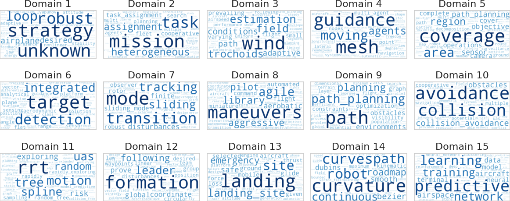
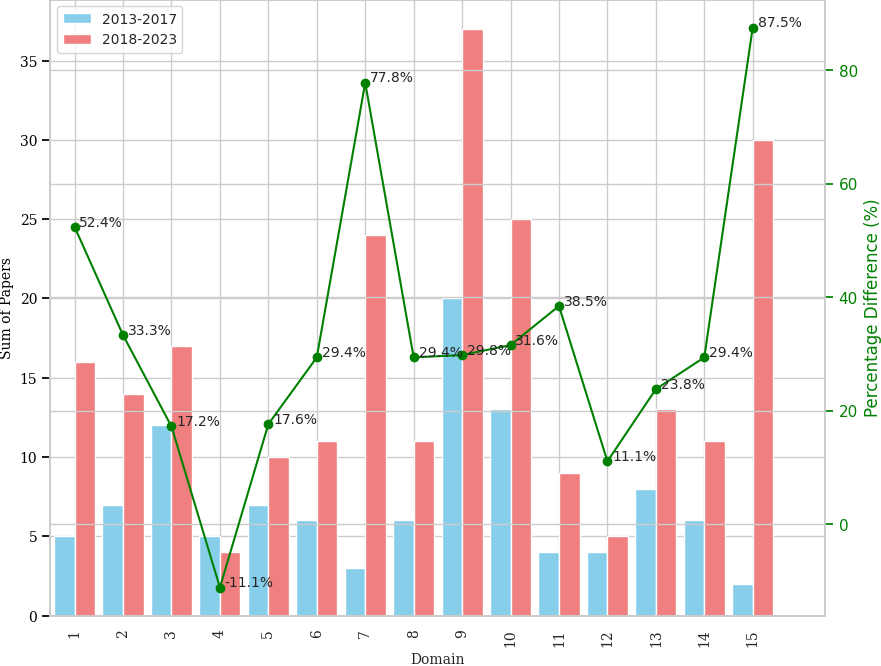

# A Systematic Literature Mapping of Path Planning and Collision Avoidance Approaches for Unmanned fixed-wings

## Abstract
In the rapidly evolving world of Unmanned Aerial Vehicles (UAVs), fixed-wing aircraft stand out for their remarkable efficiency and long-range endurance. The path planning and collision avoidance approaches for these UAVs must also take into account other constraints, such as the maximum curvature and pitch/climb angle, which are different from quadrotor drones. In this paper, we present a systematic literature mapping (SLM) in this context, which provides an overview of path planning and collision avoidance approaches developed for fixed-wing unmanned aerial vehicles in the last decade. Using Scopus and Web of Science databases, we extracted and analyzed data using the PICOC framework (Population, Intervention, Comparison, Outcome, and Context). Based on our inclusion and exclusion criteria, we identified 345 relevant articles for review. We applied an unsupervised classifier to systematically cluster these approaches into domains. The purpose of this is to highlight key topics, publication venues, and insights into the challenges and opportunities associated with path planning and collision avoidance for autonomous fixed-wing aircraft.

## Topics

## Selected papers
- [Selected papers file by domain](selected_papers_by_topic.xlsx)
  - [Papers for Domain 9](selected_path_planning.xlsx)
  - [Papers for Domain 15](selected_path_learning.xlsx)

## cite us

FREITAS, Elias JR et al. A systematic literature mapping of path planning and collision avoidance approaches for unmanned fixed-wings. In: 2024 International Conference on Unmanned Aircraft Systems (ICUAS). IEEE, 2024. p. 763-770.
